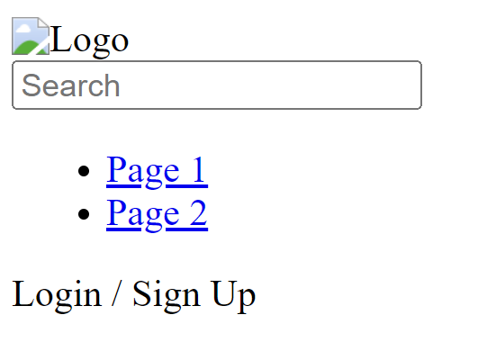

# Header Frontend - Day One Development Summary

In the first day of development, the focus was on setting up the environment and installing necessary libraries. Here's a summary of the work done:

## Environment Setup

A new React application was created using Create React App with the name `header-frontend`.

```bash
npx create-react-app header-frontend
```

## Installation of Libraries

Several libraries were installed to facilitate the development of this project. Tailwind CSS was introduced as a utility-first CSS framework for rapid UI development. PostCSS, Autoprefixer, and CRACO (Create React App Configuration Override) were also installed to help in tailoring the setup of Tailwind CSS.

The installation commands used:

```bash
npm install tailwindcss postcss autoprefixer @craco/craco
```

## Updating Scripts in `package.json`

CRACO scripts were added to the `package.json` file to replace the default start, build, and test scripts. This allows CRACO to load the Tailwind CSS configuration when running these commands. 

```json
"scripts": {
  "start": "craco start",
  "build": "craco build",
  "test": "craco test",
  "eject": "react-scripts eject"
}
```

## Creating CRACO Configuration File

A `craco.config.js` file was created to define the PostCSS plugins (Tailwind CSS and Autoprefixer) that CRACO should use.

```javascript
module.exports = {
  style: {
    postcss: {
      plugins: [
        require('tailwindcss'),
        require('autoprefixer'),
      ],
    },
  },
}
```

## Initialising Tailwind CSS Configuration

The Tailwind CSS configuration file was initialized, which creates a `tailwind.config.js` file in the root of the project.

```bash
npx tailwindcss init
```

## Importing Tailwind CSS into the Project

Finally, Tailwind CSS was imported into the project by adding the following lines to the `src/index.css` file:

```css
@import 'tailwindcss/base';
@import 'tailwindcss/components';
@import 'tailwindcss/utilities';
```

## Application Structure

We structured our application to keep things modular and readable. The header was broken down into individual components and we used the useState hook to handle the login status of the user.
Every component of the header is separated into its own file. This makes the codebase much more manageable.

## Header Component

The `Header` component is the main component that contains all other sub-components of the header. We also used the useState hook to manage the login status of the user.

## Layout Component

The `Layout` component contains the `Header` and any child components passed to it.

## App Component

The `App` component is the main component of our application. It uses the `Layout` component to render the `Header` and any other child components.

## index.js File

The `index.js` file is the entry point of our application. It is where our main `App` component is attached to the root DOM node, kickstarting our application.

## Output

The output of the application is shown below (No css is implemented yet):




## Summary 

In the first day of development, we set up the environment and installed the necessary libraries. We also structured our application to keep things modular and readable. The header was broken down into individual components and we used the useState hook to handle the login status of the user.