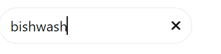

# Header Frontend - Day Two Development Summary

Day two of development focused on implementing more features for our header application and enhancing the UX/UI using Tailwind CSS. Here is a brief outline of the tasks accomplished:

## Removal of CRACO 

We removed the Create React App Configuration Override (CRACO) and stuck to a standard implementation of Tailwind CSS. 

## Enhancing Components with Tailwind CSS

Tailwind CSS was used to beautify our application components. This includes the `Logo`, `Navigation`, `SearchBar`, `UserIcon`, and `Community` components. 

## Handling Image Paths

We fixed an issue with image paths not displaying correctly by using the public folder for static assets like images. The image paths were updated to use the public URL.

## Navigation Component Enhancement

In the `Navigation` component, we added a Tailwind CSS utility class to space out the links and made the navigation more appealing.

## Enhancing the Search Bar Component

The `SearchBar` component was enhanced to replace the search icon with a cross icon when the search bar has input.

## Adding Navigation to the Logo and Community

The `Logo` and `Community` components were updated to link to their respective routes using React Router's `Link` component. Now, when the logo is clicked, it navigates to the home page, and when the community icon is clicked, it navigates to the community page.

## Summary

On day two of development, we continued to build on our header application, enhancing the UI with Tailwind CSS, improving the UX by handling image paths and adding route links to our `Logo` and `Community` components. We also fixed a bug in the `SearchBar` component, replacing the search icon with a cross icon when there is input in the search bar.

## Output Snippets:

