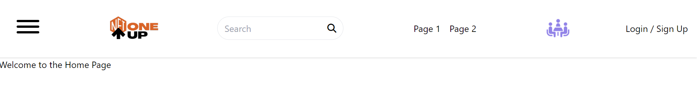
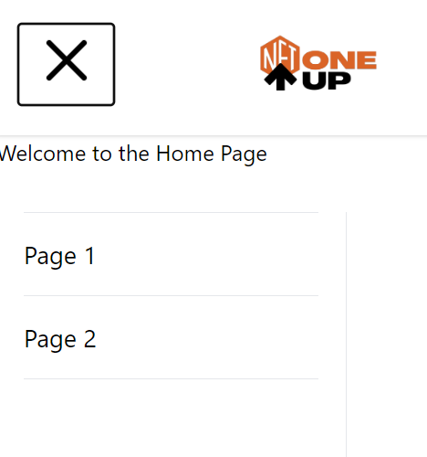

# Header Frontend - Day Three Development Summary

Day three of development focused on adding further interactivity to our header application, implementing routing, and improving css. Here is a brief outline of the tasks accomplished:

## Implementation of react-router-dom

We implemented react-router-dom to manage routes within our application. 

## Creation of Routes.js

We created a Routes.js file to handle all the routes for our application. The route configuration now resides in a centralized place, making it easier to manage.

## Addition of Hamburger Menu 

We added a Hamburger menu .

## Handling Component Visibility

We included state management to handle the visibility of our sidebar navigation on mobile views.

## HamburgerMenu Component Enhancement

In the `HamburgerMenu` component, we added a functionality to toggle the sidebar on click and made the hamburger icon change to an 'X' when the sidebar is open.

## Enhancing the Header Component

The `Header` component was enhanced with the addition of the `HamburgerMenu` component and was also made sticky to ensure it's visible to the user even on scrolling.

## Linking Navigation to Pages

The `HamburgerMenu` component was updated to link to Page 1 and Page 2 using React Router's `Link` component. Now, when each link is clicked, it navigates to their respective pages.

## Summary

On day three of development, we continued to enhance our header application, improving the mobile responsiveness with the addition of the `HamburgerMenu` component and the use of Tailwind CSS, improving the UX by handling component visibility and adding route links to our `HamburgerMenu` component.

## Output Snippets:

