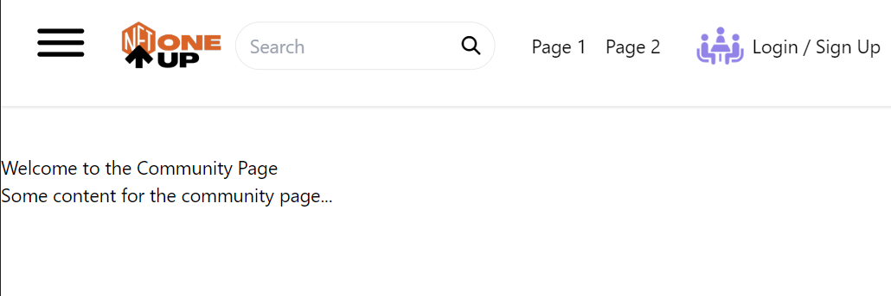
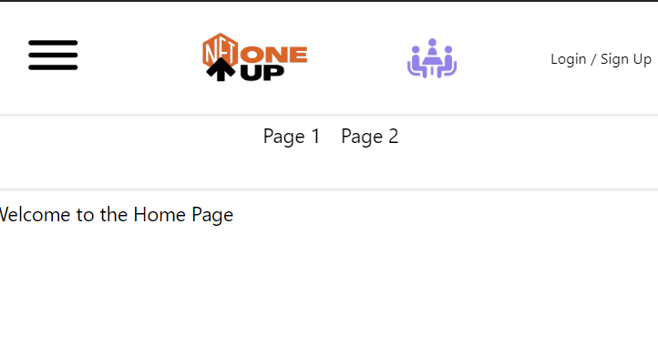

# Header Frontend - Day Four Development Summary

Day four of development was primarily focused on refining our header component by making it responsive to different screen sizes, and adapting the appearance of several elements such as the SearchBar and Navigation, depending upon the screen size. Here is a brief outline of the tasks accomplished:

## Fixing Header Position 

We made the Header component sticky so that it's always visible at the top of the website, even when scrolling down.

## Responsive Text Size

The font size of text in the Header was made responsive. Depending on the screen size, the text size for Login/Sign Up adapts appropriately for better readability and user experience.

## Adaptative Header Layout

Several changes were made to the Header component to adapt its layout according to the screen size. For smaller screens where it's not possible to display all the elements in a single row, we introduced a subheader. The Navigation component was then moved to this subheader to provide a clean and uncluttered look to the Header.

## SearchBar Responsiveness

We began working on the SearchBar component to make it responsive. The goal is to display only the search icon when the screen size is small. On clicking this search icon, the full search field will then be displayed. This task will be continued in the following day of development.

## Summary

Day four of the development involved a significant push towards making our header component more responsive. We improved how our header behaves on different screen sizes, ensured it's always visible to the user, and started working on the SearchBar responsiveness. The adaptive layout introduced for smaller screens ensures a clean and uncluttered user interface, enhancing the user experience.

## Output Snippets:

On day five of development, we aim to complete the responsiveness of the SearchBar.