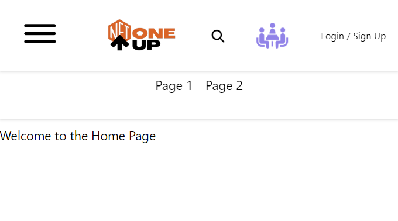
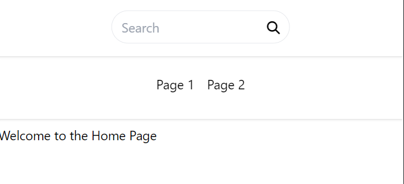

# Header Frontend - Day Five Development Summary

Day five of our development focused on finalizing the SearchBar component. We ensured its responsiveness across different screen sizes and incorporated toggle functionality to optimize space usage on smaller screens. Here is a summary of the day's tasks:

## SearchBar Toggleness

We implemented a feature that allows the SearchBar to be toggled on and off, enhancing user interaction with the component. Users can now activate the SearchBar by clicking on the search icon. Once the SearchBar is active, clicking outside of it or on the cancel icon (if a search term is entered) will deactivate it.

## Summary

On day five of development, we successfully improved the functionality and responsiveness of the SearchBar component.

## Output Snippets:

And that is the end of the development of our header component. We have successfully implemented all the features we had planned for it. The header is now responsive, adaptive, and user-friendly.