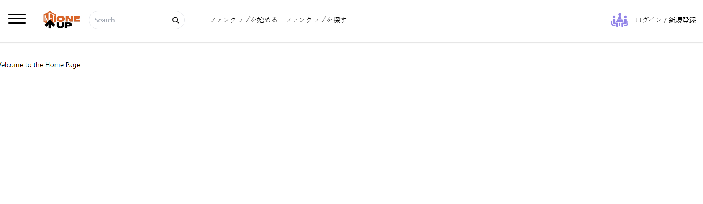
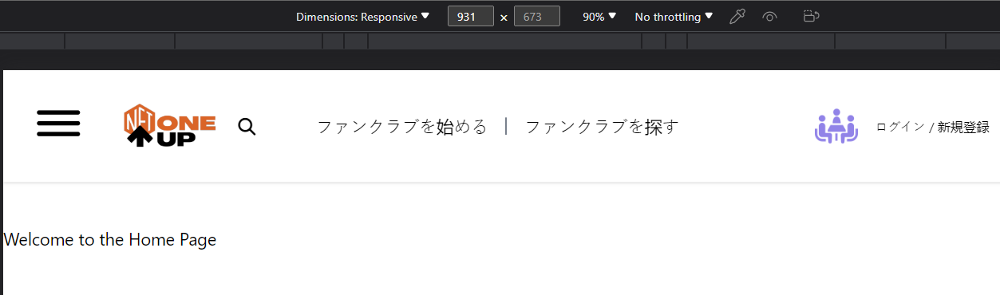

# Header Frontend - Day Six Development Summary

Day six of development brought with it several changes and improvements to the header components, including an important language change and refinements in the responsive design. Below is an outline of the tasks accomplished:

## Language Change

In order to better accommodate our target user base, the language of the application was changed to Japanese. This strategic decision should improve the overall user experience by providing a familiar and intuitive interface for our users.

## Tailwind 'md' Breakpoint Change

Tailwind CSS's 'md' breakpoint was modified to activate at 960px. This change provides a dynamic behavior to our SearchBar, which now only displays as a button below the 960px screen width. This modification enhances the mobile experience and ensures the header remains clean and uncluttered.

## Header Component Arrangement

The layout and arrangement of components in the header were refined, providing the desired spacing between them. Components such as the Hamburger, Logo, and SearchBar were grouped together and aligned to the left, with the Navigation component placed at a slightly larger gap. The Community and UserIcon components were moved to the extreme right, resulting in a balanced and harmonious header design.

## User Icon Replacement

The original User icon was replaced with a user-specific image fetched from a URL. This change adds a personalized touch to the user interface and enhances user recognition.

## Summary

Day six marked a significant step towards perfecting our header design. The introduction of a preferred language, refined component arrangement, breakpoint adjustments, and personalized User icon vastly improve the overall user experience. The enhancements ensure the user interface remains clean, familiar, and user-centric.

## Output Snippets:

